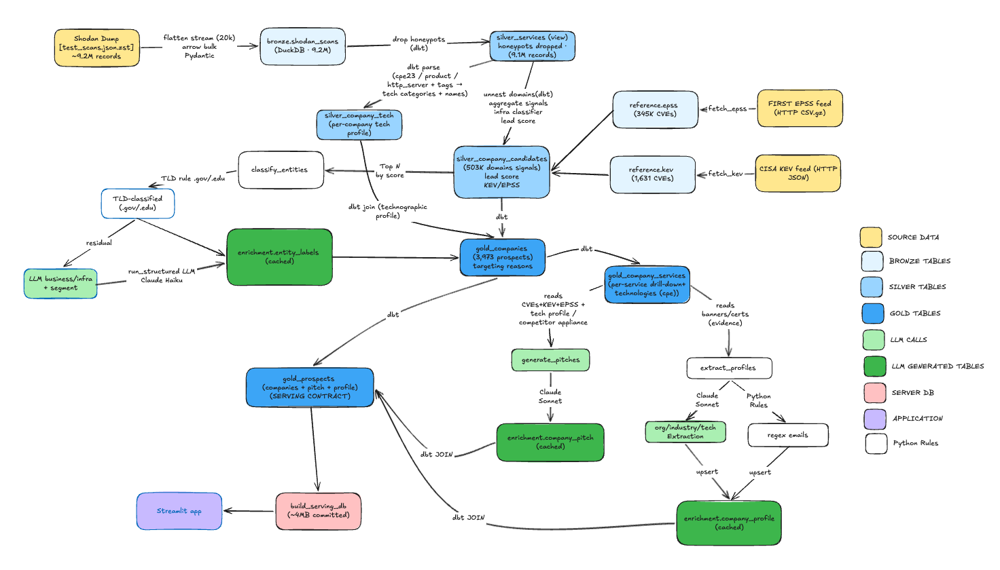
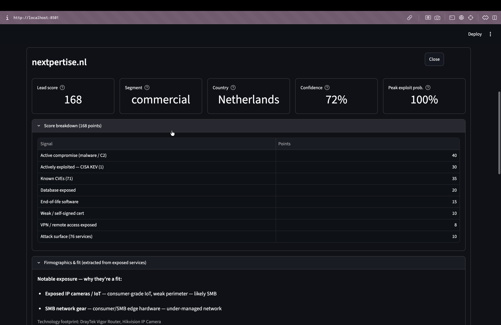
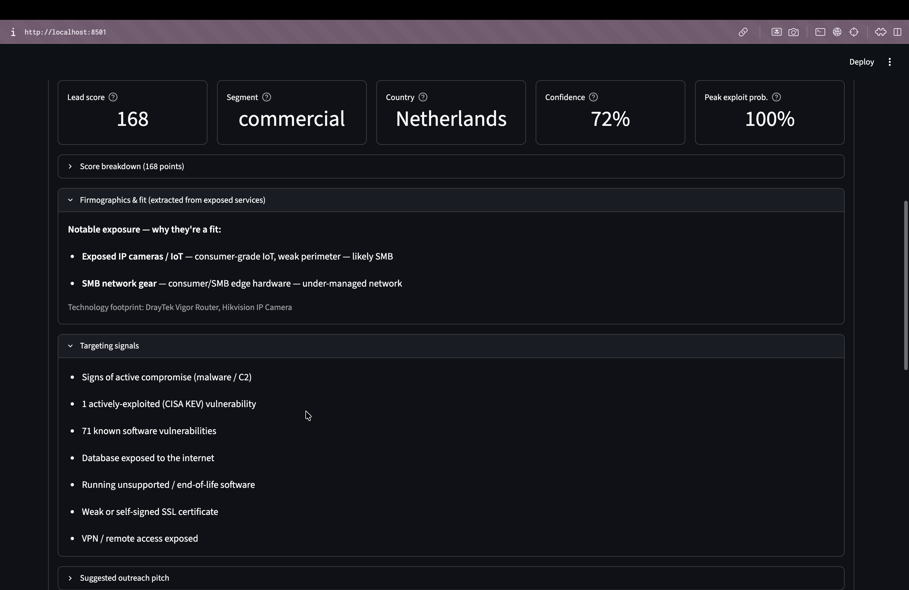
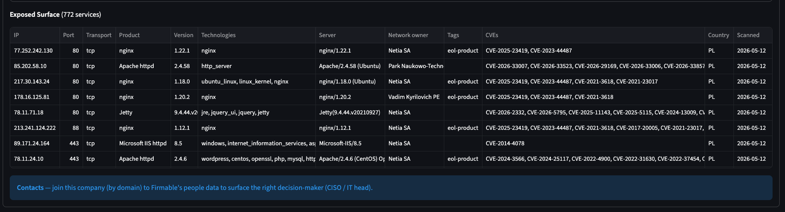

# Architecture — Osprey

Sales intelligence for cybersecurity vendors: turn Shodan internet-exposure scans
into a ranked list of prospect companies (with reasons + grounded outreach pitches).
For the *why* (business problem, prospecting methodology, competitive landscape) see
[docs/ProblemAndApproach.md](docs/ProblemAndApproach.md).

---

## 1. Data flow (medallion)



Colour key: **layer** (source / bronze / silver / gold) and **who does the work** —
**white = Python/dbt rules**, **light green = LLM calls**, **dark green = LLM-generated
cached tables**, pink = serving DB, purple = app. The LLM runs in only three spots
(Haiku entity classification, Sonnet pitch, Sonnet firmographic extraction); everything
else is deterministic rules + dbt.

*Cycle note: the pitch/profile steps read `gold_companies`/`gold_company_services` and
write to `enrichment`; a downstream `gold_prospects` model joins them back — so the app
never reads `enrichment` directly and there is no build cycle.*

**Key invariants:** (1) the LLM runs only during offline enrichment builds — the app
reads **cached, materialized gold** tables, so the demo is deterministic and shareable
with no API key. (2) **Gold is the single serving contract**; the pitch/profile steps
read `gold_companies` and write to `enrichment`, and a downstream `gold_prospects`
model joins them back — so nothing depends on the app reading `enrichment` directly,
and there is no build cycle.

### What the design produces (app views)

Transparent additive scoring — every point traced back to a signal (§7):



Firmographics extracted from banners + a grounded outreach pitch that cites only
real, verifiable CVEs (KEV/EPSS-tagged):




## 2. Stack & why

| Concern | Choice | Rationale (prototype → production analogue) |
|---|---|---|
| Warehouse | **DuckDB** (one file) | Zero-ops analytical engine; single-file is perfect for a prototype. Prod: Snowflake/BigQuery. |
| Transforms | **dbt (dbt-duckdb)** | SQL transforms with tests + lineage; portable to any warehouse. |
| Ingestion / enrichment | **Python 3.12 + uv** | Streaming ingest, LLM orchestration; uv = fast, reproducible env (no Docker needed for a prototype). |
| LLM | **Claude via CLI transport** | Uses existing login (no API key to share); one swappable transport module. Haiku for classification, Sonnet for firmographic extraction + pitches. |
| Contracts | **Pydantic** | Single source of truth: schema → DuckDB DDL → Arrow schema → validation. |
| Orchestration | **Dagster** (thin, illustrative) | One-time batch needs no scheduler; shows lineage + that steps are orchestrator-agnostic. |
| App | **Streamlit + AgGrid** | Fast sales-facing dashboard; AgGrid for clickable rows. |

## 3. Module map (what owns what)

```
osprey/                       # Python package (platform + thin pipeline steps)
  config.py                   #   all paths, model ids, thresholds, vendor context
  schemas.py                  #   ALL Pydantic contracts + Bronze DuckDB DDL
  warehouse.py                #   the ONLY module that talks to DuckDB
  llm/                        #   shared LLM platform
    client.py                 #     CLI transport + per-call trace (swap for API in prod)
    prompts.py                #     versioned prompts (entity, pitch, extraction)
    runner.py                 #     batched + concurrent structured-output runner
    trace.py                  #     observability: token/cost/latency trace per call
    eval.py                   #     entity-classification eval (precision/recall/F1)
    eval_extract.py           #     firmographic-extraction eval (precision/recall/F1)
  pipelines/                  #   dagster-agnostic pure functions:
    ingest_bronze.py          #     stream .zst -> bronze
    fetch_kev.py              #     CISA KEV connector -> reference.kev
    fetch_epss.py             #     FIRST EPSS connector -> reference.epss
    classify_entities.py      #     TLD rule + LLM classify
    enrich_entities.py        #     top-N -> entity_labels (cached)
    generate_pitches.py       #     gold -> grounded pitches (cached)
    extract_profiles.py       #     banners -> firmographics (rules + LLM, cached)
    build_serving_db.py       #     export small deployable DB
  orchestration/
    definitions.py            #   Dagster assets wrapping the pipeline steps
transform/                    # dbt project (SQL only; NOT a Python package)
  models/silver/ · gold/      #   the medallion SQL + tests (schema.yml)
    silver_company_tech.sql   #     deterministic technology profile (no LLM)
  seeds/country_codes.csv     #   reference data (ISO country names)
app/app.py                    # Streamlit dashboard (reads gold + cached pitches)
data/serving/                 # small committed serving DB (for hosting)
```

## 4. Stage-wise build map (planning summary)

Each stage has a `docs/StageN_*.md` with SQL-backed numbers.

| Stage | Doc | Primary files | Output |
|---|---|---|---|
| 1 Data discovery | Stage1 | `data/analysis/*.sql`, `data/samples/` | schema + strategy |
| 2 Setup | Stage2 | `pyproject.toml`, `uv.lock` | reproducible env |
| 3 Raw ingestion | Stage3 | `pipelines/ingest_bronze.py`, `schemas.py`, `warehouse.py` | `bronze.shodan_scans` (9.1M) |
| 4 Company resolution | Stage4 | `data/analysis/company_resolution.sql` | domain-as-company thesis |
| 5 Entity classification | Stage5 | `pipelines/classify_entities.py`, `llm/*`, `data/evals/` | classifier + eval |
| 6 Silver transform | Stage6 | `transform/models/silver/*.sql` | candidates + score (503k) |
| 7 LLM enrichment | Stage7 | `pipelines/enrich_entities.py`, `generate_pitches.py` | labels + pitches (cached) |
| 8 Gold mart | Stage8 | `transform/models/gold/*.sql`, `schema.yml` | ~3,973 prospects + reasons |
| 9 App | Stage9 | `app/app.py` | Streamlit dashboard |
| 10 Orchestration | (this doc §5) | `orchestration/definitions.py` | Dagster lineage |
| 11 Hosting | (this doc §6) | `build_serving_db.py`, `requirements.txt` | serving DB + deploy |

## 5. Orchestration (why thin)

This is a **one-time batch** — no scheduled ingestion, no recurring interdependent
jobs, no backfills/SLAs, one day of data. A scheduler would be over-engineering.

What we do instead: keep every step a **pure, orchestrator-agnostic function** in
`pipelines/`, and expose them as a thin Dagster asset graph
(`orchestration/definitions.py`) purely to show the lineage:

```
kev_catalog ┐
epss_catalog┼→ silver_models → entity_labels → gold_companies ─┬→ company_pitches ─┐
bronze_scans┘                                                  └→ company_profiles ┴→ gold_prospects
```

**Production path:** the same graph gains a **schedule** and a **sensor** on new
Shodan dumps; the steps themselves don't change. This is the payoff of the
pipelines-vs-orchestration split.

## 6. Hosting

The full warehouse is GBs (bronze/silver). The app reads only `gold.gold_prospects`
+ `gold.gold_company_services`, so `build_serving_db.py` exports just those into a
**~4 MB serving DB** that is committed and deployed (enrichment is already baked into
`gold_prospects`, so no enrichment tables ship). The app auto-prefers the serving DB
when present. Deploy target: Streamlit Community Cloud (`app/app.py`, Python 3.12,
`requirements.txt` app-only subset) — no API key, no live LLM.

## 7. Design decisions & trade-offs

- **Rules first, LLM for the residual.** Deterministic infra classifier + TLD rules
  handle the bulk; the LLM refines only the top-N head where errors are visible.
  Cheap, and the LLM earns its cost.
- **LLM as a production system, not a toy.** Versioned prompts, labelled evals,
  confidence gating + deterministic guardrails, cached/idempotent outputs, grounded
  (never-invented) CVE citations.
- **Structured, grounded outreach pitch (`prompts.py` v5).** Each prospect's pitch is a
  scannable brief — *What we found / Why it matters / Across their stack / Suggested
  opening* — grounded in real CVEs (KEV/EPSS-tagged) **and** the deterministic tech
  profile, so it can open with a **competitive-displacement** angle when a rival security
  appliance is detected ("we noticed you're running FortiWeb"). Sonnet, cached; the app
  reads the frozen pitch and renders it as markdown.
- **Observability from day one.** Every LLM call is traced (`osprey/llm/trace.py`) with
  prompt version, model, token usage, cost, latency, and success — append-only JSONL,
  thread-safe under the concurrent runner. `python -m osprey.llm.trace` reports
  cost/latency per task; the foundation for cost ceilings and model-drift detection.
- **Extraction: rules where regular, LLM where semantic.** Firmographics from messy
  banners — emails by regex, org/industry/tech by Sonnet (barred from inventing). A
  labelled eval (`eval_extract.py`) caught real bugs (SSH strings as emails, null-byte
  crashes, signal-blind sampling); fixing sampling took org F1 59% → 100% on the set.
- **Third-party enrichment where it sharpens the signal.** Two free, no-auth connectors
  — `fetch_kev.py` (CISA KEV, actively-exploited) and `fetch_epss.py` (FIRST EPSS,
  exploit probability) — land as `reference.*` dbt sources that silver joins, so
  "exploited in the wild" / "97% exploit-likely" (not just "a CVE exists") drive
  ranking and the pitch. The connector + reference-data pattern the role wants. An
  honest, **SQL-backed** finding
  ([`kev_epss_analysis.sql`](data/analysis/kev_epss_analysis.sql)): among prospects
  with a CVE, **96% peak at EPSS≥0.5** (94% at ≥0.9) — near-universal, so EPSS is a
  weak *ranking* input. Decision: EPSS drives the pitch/display, **not** the score;
  KEV (86.6% coverage, but authoritative + binary) stays in the score (+30).
- **Deterministic technology extraction (no LLM).** Shodan already fingerprints
  technologies (`product`, `http_server`, `cpe23`) and tags services
  (`cloud`/`cdn`/`database`/`ai`/`ics`/`devops`); `silver_company_tech` parses these
  into a per-company **tech profile** — at zero LLM cost, so it scales to all 500k
  candidates, not just the enriched head. This is the **technographic layer** that
  B2B prospecting stacks on top of firmographics: it powers ICP fit, **competitive
  displacement** (detecting a rival's appliance in the environment — the highest-value
  technographic play, since most B2B software buys are replacements), and a net-new
  **exposed-AI/ML** trigger. SQL-backed in
  [`data/analysis/tech_signals.sql`](data/analysis/tech_signals.sql).
- **Deeper extraction, still deterministic (v4).** The dataset carries far more than broad
  categories, so `silver_company_tech` also mines: **versioned technology** (`product@version`
  — Shodan reports a concrete version on ~5% of services and in ~21% of cpe23 rows),
  **legacy / EOL detection** (version-gated — Python 2.x / PHP ≤5 / OpenSSH <7 / Apache 2.2 /
  MySQL 5.x — plus Shodan's own `eol-product`/`eol-os` tags), and **hosting / infrastructure**
  (`hosting_providers` = normalized cloud/CDN from the network owner; `hosting_network` = the
  dominant ISP/AS operator, present for ~99% of prospects so "where are they hosted" is rarely
  blank). Surfaced as a **technology/version search**, a **hosting filter + column**, and an
  **IPs-per-domain** footprint filter. Version-specific legacy is the highest-value trigger — an
  unsupported, known-vulnerable stack is a direct reason to call. SQL-backed in
  [`data/analysis/extraction_v4.sql`](data/analysis/extraction_v4.sql).
- **Exposure surface from the port inventory (v4).** The clearest cyber-sales trigger isn't
  a category, it's a *specific risky service open to the internet*. `silver_company_tech`
  names them from well-known ports (`exposed_services` + `has_rdp`/`has_telnet`/`has_ftp`/
  `has_smb`) — RDP, SMB, Telnet, FTP, exposed databases (MySQL/Postgres/Mongo/Redis/Elastic),
  and orchestration APIs (Kubernetes/Docker). 2,798 prospects expose ≥1; surfaced as
  click-to-filter chips, targeting reasons, and a detail line. `ssl_issuers` adds a CA-hygiene
  signal. An honest **null result** is recorded too: a deterministic org name from the cert
  subject (`O=`) was attempted but prospect certs are CN-only (0 of 97k carry an org field),
  so it was dropped rather than shipped empty — mined, not viable, documented.
- **HTTP-title mining + a full column audit (v4).** The page title names internet-facing
  **management/control panels** (`exposed_panels` + `has_admin_panel`) — cPanel/WHM (524),
  Plesk, Synology, firewall/router logins (MikroTik/pfSense/SonicWall/Fortinet), DevOps
  consoles (Grafana/Portainer/MinIO) — 1,366 prospects expose one, a high-value target.
  `city_count` (distinct host cities) is a rough size proxy. The dead `asn` column was
  **removed** (org/isp already carry the network owner). A deliberate discipline here: a
  **24-column bronze audit** (mined / explored / n/a) is recorded in
  [`data/analysis/extraction_v4.sql`](data/analysis/extraction_v4.sql) so extraction coverage
  is provable, not assumed.
- **Infrastructure is a segment, not noise (v4).** The entity classifier still labels
  hosting/ISP as `infra`, but gold now keeps `entity_class in (business, infra)` and tags
  each row. The app shows the **full universe by default (~6,654)** with a **Business-Only
  Prospects** toggle that collapses to the "see past the hosting layer" view (~3,973).
  Hosting providers, ISPs and datacenters are themselves high-surface cybersecurity buyers —
  a distinct ICP, always available, and one toggle away from the clean business-only view. The
  `flagged` guardrail (low confidence / footprint contradiction) still excludes — a
  label-quality gate, orthogonal to the business-vs-infra choice.
- **Single-writer warehouse.** Steps run in dependency order; the app connects
  read-only. (Prod: a real warehouse removes this constraint.)
- **Transparency over black-box.** The lead score is an explainable additive formula,
  surfaced in-app as a breakdown — no unexplainable numbers.
- **Skills over scripts.** The recurring enrichment shape (rules-first, schema, versioned
  prompt, cache, eval, trace, gold-join) is packaged as a reusable spec:
  [`skills/add-llm-enricher/SKILL.md`](skills/add-llm-enricher/SKILL.md) — loadable by
  engineers and agents to add the next enricher consistently.

## 8. Honest limitations & roadmap (v2)

- **Coverage:** LLM labels a wide head → ~3,973 verified prospects, not the full
  75k signal-bearing candidates. Enrich deeper to grow.
- **Severity/likelihood:** **CISA KEV** (actively-exploited) boosts the score (+30) and
  leads the reasons; **FIRST EPSS** (exploit probability) is carried per prospect
  (peak) for the pitch + display. **CVSS (NVD)** severity is v2 — its per-CVE API is
  rate-limited, impractical for thousands of CVEs without a bulk pull.
- **Firmographics:** technology profile is now **deterministic** (`silver_company_tech`,
  full coverage); org/industry are LLM-extracted from banners (sparse — ~49% get an
  org name). Deeper firmographic ICP (size/revenue) + **contacts via Firmable** is next.
- **Freshness:** a single-day scan slice; production needs recurring ingestion.
- **Score weights** are a heuristic prior, not calibrated on conversion data.
- **Ethical framing:** exposure ≠ certainty; outreach language stays "we noticed",
  not accusatory, to respect false-positive risk.
