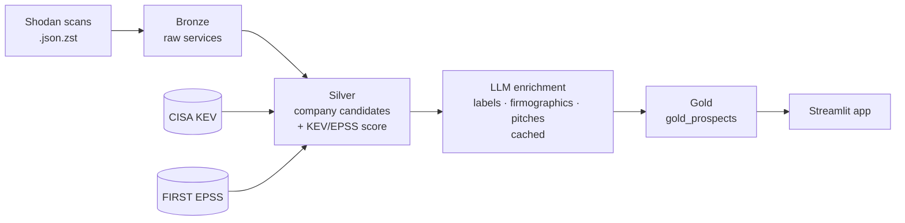

# Osprey — Sales Intelligence for Cybersecurity Vendors

An osprey hovers above the water and sees straight through the surface to the fish
beneath. Osprey does the same over the internet's exposure data — seeing past the
CDN/hosting layer to the real company underneath, and turning Shodan network scans
into a **ranked list of prospect companies** (with plain-English reasons and grounded
outreach pitches) so a cybersecurity vendor's sales team knows **who to target, and why**.

Built as a take-home for Firmable (Senior Data Engineer, Sourcing).

**[Live demo →](https://ospery.streamlit.app)** — fully interactive: click any prospect
row to open its detail, filter by region / segment / signal, and read the grounded pitch.


- **What it does:** detects internet-facing exposures (CVEs, exposed databases,
  end-of-life software, weak certs, VPN/IoT, malware/C2), resolves them to real
  companies, ranks by a transparent lead score, and drafts a grounded sales pitch.
- **Why it works:** for a cyber vendor, an exposure is a *trigger event* — a timely,
  specific reason to reach out. See [docs/ProblemAndApproach.md](docs/ProblemAndApproach.md).

---

## Quickstart

Requires [uv](https://docs.astral.sh/uv/) for environment management:

```bash
curl -LsSf https://astral.sh/uv/install.sh | sh   # install uv (macOS/Linux)
uv sync                                            # Python 3.12 + deps from the lockfile

# Serve the demo (uses the small committed serving DB — no warehouse build needed)
uv run streamlit run app/app.py                    # http://localhost:8501
```

To rebuild the data end-to-end from the source scan file:

```
ingest (bronze) → fetch KEV + EPSS feeds → dbt (silver, KEV/EPSS-aware score)
                → LLM enrich (entity labels) → dbt (gold)
                → LLM firmographic extraction + grounded pitches → dbt (gold_prospects)
                → build serving DB → app
```

Every command (ingestion, dbt, enrichment, evals, pitches, Dagster, serving DB) is in
[docs/helper_commands.md](docs/helper_commands.md).

## Architecture

Medallion: **Bronze** (raw scans) → **Silver** (clean, per-company candidates +
KEV/EPSS-aware score) → **LLM enrichment** (business/infra labels, firmographic
extraction, grounded pitches — all cached) → **Gold** (ranked prospect marts +
`gold_prospects` serving model) → **App**. Third-party feeds (CISA KEV, FIRST EPSS)
join in silver. The app reads only cached tables — it never calls the LLM live, so
the demo is deterministic and shareable with no API key.



Full detail, LLD diagram, and design trade-offs: [Architecture.md](Architecture.md).

## Stack

DuckDB (warehouse) · dbt (SQL transforms) · Python 3.12 + uv (ingestion, LLM
orchestration) · Claude via CLI (Haiku for classification, Sonnet for firmographic
extraction + pitches) · CISA KEV + FIRST EPSS feeds · Dagster (thin, illustrative
lineage) · Streamlit + AgGrid (app).

## Repository layout

```
osprey/         Python package — config, schemas, warehouse, llm/, pipelines/, orchestration/
transform/      dbt project — silver + gold SQL, tests, country seed
app/            Streamlit dashboard
data/           analysis SQL, eval sets, samples, serving DB (warehouse is git-ignored)
docs/           one doc per stage + ProblemAndApproach + helper_commands + context/
skills/         reusable SKILL.md specs (e.g. add-llm-enricher) for engineers & agents
Architecture.md project architecture, diagrams, roadmap
```

## Screenshots

Ranked prospect list — actively-compromised rows tinted red, KEV-exposed amber;
click a row to open detail, or use the clickable legend / region chart to filter:


Company detail — transparent score breakdown, firmographics extracted from banners,
and a grounded outreach pitch citing only real CVEs (KEV/EPSS-tagged):


## Status

**v1 + v2 (done & hosted):** discovery → bronze → silver → LLM classification + eval →
enrichment → gold mart + dbt tests → Streamlit app → grounded LLM pitches → LLM
observability traces → Dagster lineage → serving DB + hosting. **v2 added:**
third-party **CISA KEV** (actively-exploited, +30 score) + **FIRST EPSS** (exploit
probability) feeds, **LLM firmographic extraction** from banners (org / industry /
tech, with eval), prospect universe expanded to **~3,973**, richer KEV/EPSS/org-grounded
pitches (v4), and a redesigned app (company column, red/amber row-marking, region
territory filter, clickable-legend filters).

**Backlog:** NVD/CVSS severity ranking (rate-limited API), Firmable contacts join,
firmographic ICP filters, recurring ingestion (freshness), CSV/CRM export. See
[Architecture.md](Architecture.md#8-honest-limitations--roadmap-v2).
