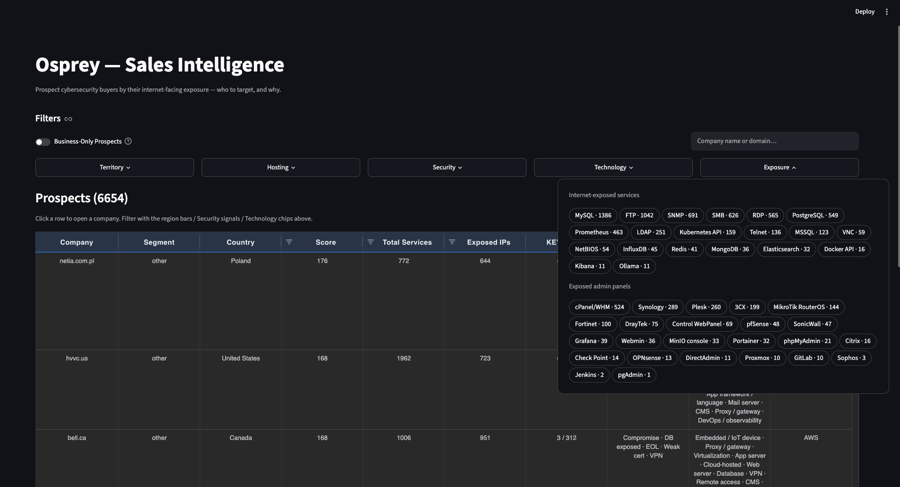
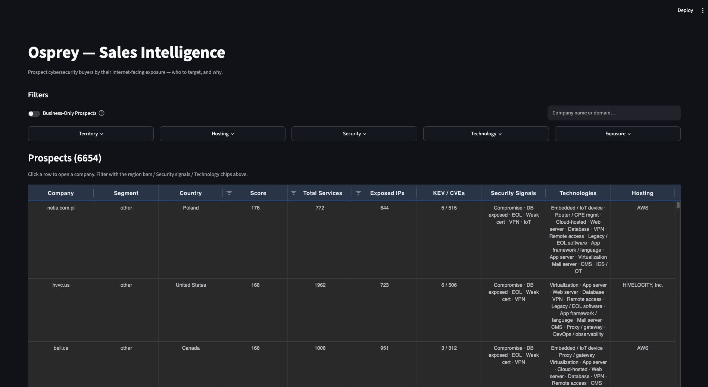
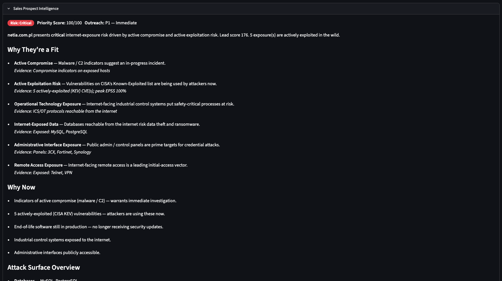

# Osprey — Sales Intelligence for Cybersecurity Vendors

An osprey hovers above the water and sees straight through the surface to the fish
beneath. Osprey does the same over the internet's exposure data — seeing past the
CDN/hosting layer to the real company underneath, and turning Shodan network scans
into a **ranked list of prospect companies** (with plain-English reasons and grounded
outreach pitches) so a cybersecurity vendor's sales team knows **who to target, and why**.

Built as a take-home for Firmable (Senior Data Engineer, Sourcing).

**[Live demo →](https://ospery.streamlit.app)** — fully interactive: click any prospect
row to open its detail, filter by region / segment / signal, and read the grounded pitch.



- **What it does:** detects internet-facing exposures (CVEs, exposed databases,
  end-of-life software, weak certs, VPN/IoT, malware/C2), resolves them to real
  companies, ranks by a transparent lead score, and drafts a grounded sales pitch.
- **Technographic targeting:** a **deterministic technology profile** (web stack,
  infra/CDN/cloud, databases, **exposed AI/ML tooling**, ICS/OT — no LLM, from Shodan's
  own fingerprints) powers ICP filters and competitive-displacement plays.
- **Why it works:** for a cyber vendor, an exposure is a *trigger event* — a timely,
  specific reason to reach out. See [docs/ProblemAndApproach.md](docs/ProblemAndApproach.md).

---

## Quickstart

Requires [uv](https://docs.astral.sh/uv/) for environment management:

```bash
curl -LsSf https://astral.sh/uv/install.sh | sh   # install uv (macOS/Linux)
uv sync                                            # Python 3.12 + deps from the lockfile

# Serve the demo (uses the small committed serving DB — no warehouse build needed)
uv run streamlit run app/app.py                    # http://localhost:8501
```

To rebuild the data end-to-end from the source scan file:

```
ingest (bronze) → fetch KEV + EPSS feeds → dbt (silver, KEV/EPSS-aware score)
                → LLM enrich (entity labels) → dbt (gold)
                → LLM firmographic extraction + grounded pitches → dbt (gold_prospects)
                → build serving DB → app
```

Every command (ingestion, dbt, enrichment, evals, pitches, Dagster, serving DB) is in
[docs/helper_commands.md](docs/helper_commands.md).

## Architecture

Medallion: **Bronze** (raw scans) → **Silver** (clean, per-company candidates +
KEV/EPSS-aware score) → **LLM enrichment** (business/infra labels, firmographic
extraction, grounded pitches — all cached) → **Gold** (ranked prospect marts +
`gold_prospects` serving model) → **App**. Third-party feeds (CISA KEV, FIRST EPSS)
join in silver. The app reads only cached tables — it never calls the LLM live, so
the demo is deterministic and shareable with no API key.


*Colour-coded by layer (bronze/silver/gold) and by who does the work — **white =
Python/dbt rules**, **light green = LLM calls**, **dark green = LLM-generated cached
tables**. LLM runs in just three spots (Haiku classify, Sonnet pitch, Sonnet
firmographics); the bulk is deterministic.*

Design trade-offs and the component/contract spec: [Architecture.md](Architecture.md).

## Stack

DuckDB (warehouse) · dbt (SQL transforms) · Python 3.12 + uv (ingestion, LLM
orchestration) · Claude via CLI (Haiku for classification, Sonnet for firmographic
extraction + pitches) · CISA KEV + FIRST EPSS feeds · Dagster (thin, illustrative
lineage) · Streamlit + AgGrid (app).

## Repository layout

```
osprey/         Python package — config, schemas, warehouse, llm/, pipelines/, orchestration/
transform/      dbt project — silver + gold SQL, tests, country seed
app/            Streamlit dashboard
data/           analysis SQL, eval sets, samples, serving DB (warehouse is git-ignored)
docs/           one doc per stage + ProblemAndApproach + helper_commands + context/
skills/         reusable SKILL.md specs (e.g. add-llm-enricher) for engineers & agents
Architecture.md project architecture, diagrams, roadmap
```

## Screenshots

Ranked prospect list — click any row to open its detail; filter with the popover facet
bar (Territory · Hosting · Security · Technology · Exposure), each count-labelled:



Company detail — a deterministic **Sales Prospect Intelligence** brief: risk level,
why-now triggers, grouped attack surface, top risk signals, and ready-to-use talking points:



The exposed-surface drill-down — every internet-facing service with its product, version,
technologies, server, network owner and CVEs:


## Status

**v1 + v2 (done & hosted):** discovery → bronze → silver → LLM classification + eval →
enrichment → gold mart + dbt tests → Streamlit app → grounded LLM pitches → LLM
observability traces → Dagster lineage → serving DB + hosting. **v2 added:**
third-party **CISA KEV** (actively-exploited, +30 score) + **FIRST EPSS** (exploit
probability) feeds, **LLM firmographic extraction** from banners (org / industry /
tech, with eval), prospect universe expanded to **~3,973**, richer KEV/EPSS/org-grounded
pitches (v4), and a redesigned app (company column, red/amber row-marking, region
territory filter, clickable-legend filters).

**v3 added:** a **deterministic technology profile** (`silver_company_tech`, no LLM) —
web stack, infra/CDN/cloud, databases, DevOps, **exposed AI/ML tooling**, ICS/OT —
parsed from Shodan's own fingerprints (`cpe23`/`product`/`http_server`/tags); surfaced
as an "AI/ML exposed" KPI, a Technology filter, a detail tech-profile section, and
AI/ICS targeting reasons. SQL-backed in `data/analysis/tech_signals.sql`.

**v3.1 added:** a **structured pitch (v5)** — a scannable *What we found / Why it matters
/ Across their stack / Suggested opening* brief, tech-grounded with a **competitive-
displacement** angle when a rival security appliance is detected; **per-service
technologies** on `gold_company_services` (cpe-derived); and an **app dashboard redesign**
— clickable Security-signals / Technology chip filters, a richer prospect table (Total
Services · Exposed IPs · KEV/CVEs · Security Signals · Technologies), and a company
detail with importance-ordered stat tiles + a Score-breakdown bar chart +
Products/Technologies/Transport charts + a per-company Technologies distribution.

**v4 added** — a deep, deterministic mining pass over the dataset (no LLM), on the thesis
that *the more you mine the scan data, the more targeting signal you find*:

- **Versioned technology** (`product@version`) + **legacy/EOL detection** — who still runs
  Python 2.x / MySQL 5.x / Apache 2.2 (from Shodan's version fingerprints + eol tags).
- **Technology / version search** — find prospects running a specific tech (mongodb, redis,
  wordpress, `openssh 7`…), not just a broad category.
- **Exposure surface from the port inventory** — **risky internet-facing services** (RDP,
  SMB, Telnet, FTP, exposed databases, Kubernetes/Docker APIs) — the sharpest cyber trigger;
  2,798 prospects expose ≥1.
- **Exposed admin / control panels** from the HTTP page title — cPanel/WHM, Plesk, firewall &
  router logins (MikroTik/pfSense/SonicWall/Fortinet), DevOps consoles — 1,366 prospects.
- **Hosting / infrastructure** — normalized cloud/CDN provider + dominant network owner
  (column + filter); plus a **geographic footprint** size proxy (distinct cities).
- **Infrastructure as a segment** — gold keeps hosting/ISP providers too; the app shows the
  full universe by default (~6,654) with a **Business-Only Prospects** toggle for the "see
  past the hosting layer" view (~3,973).

All click-to-filter, count-labelled, and cascading; backed by a **24-column data audit** in
`data/analysis/extraction_v4.sql` (mined / explored / n/a — coverage is provable, not assumed).

**Backlog:** NVD/CVSS severity ranking (rate-limited API), Firmable contacts join,
firmographic ICP filters, recurring ingestion (freshness), CSV/CRM export. See
[Architecture.md](Architecture.md#8-honest-limitations--roadmap-v2).
